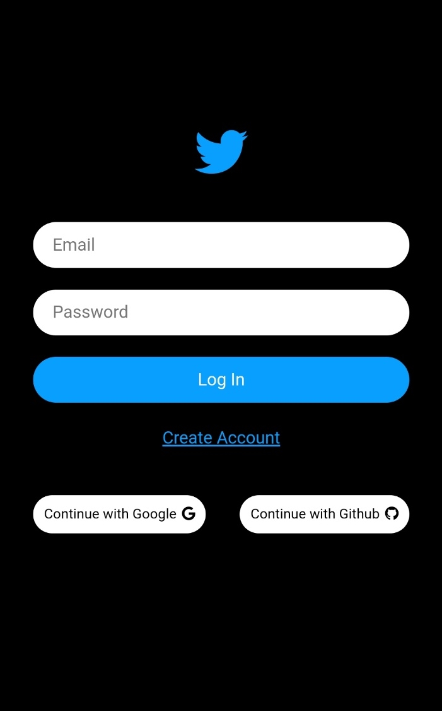
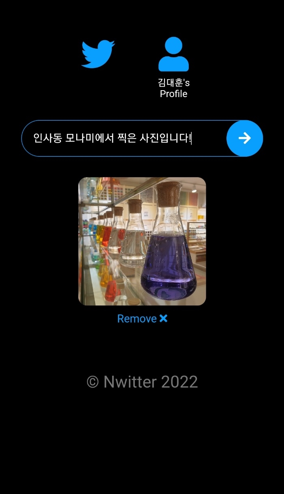
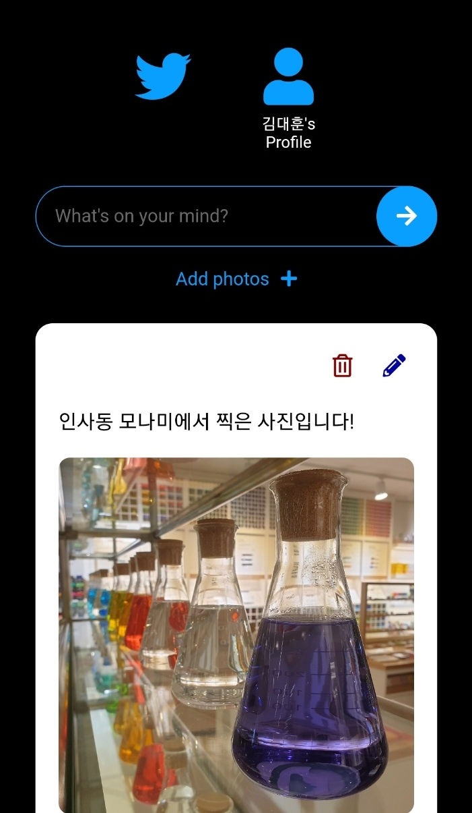
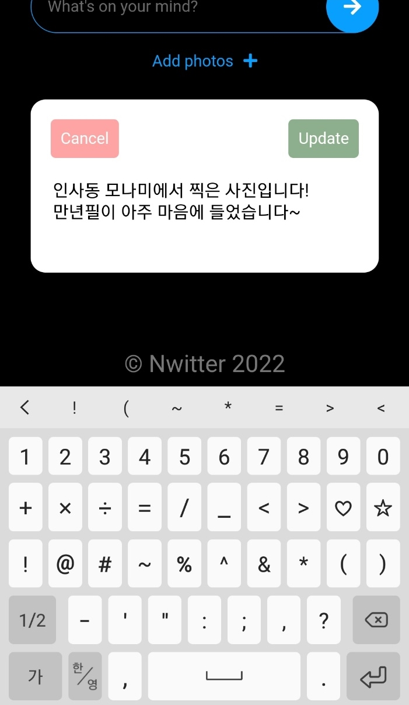
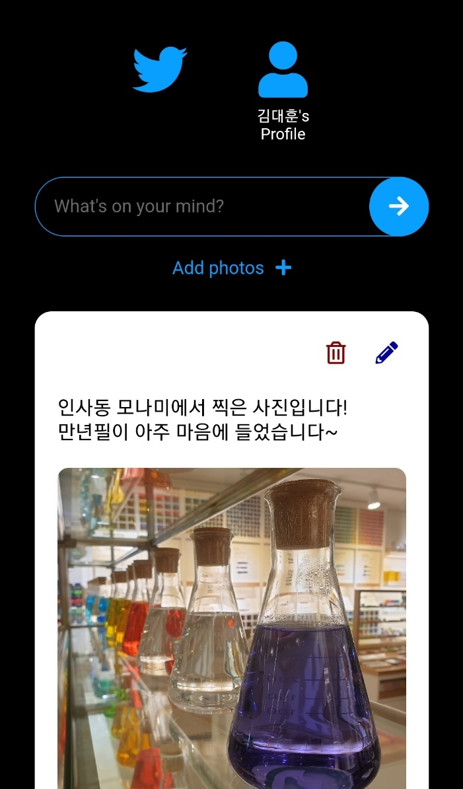
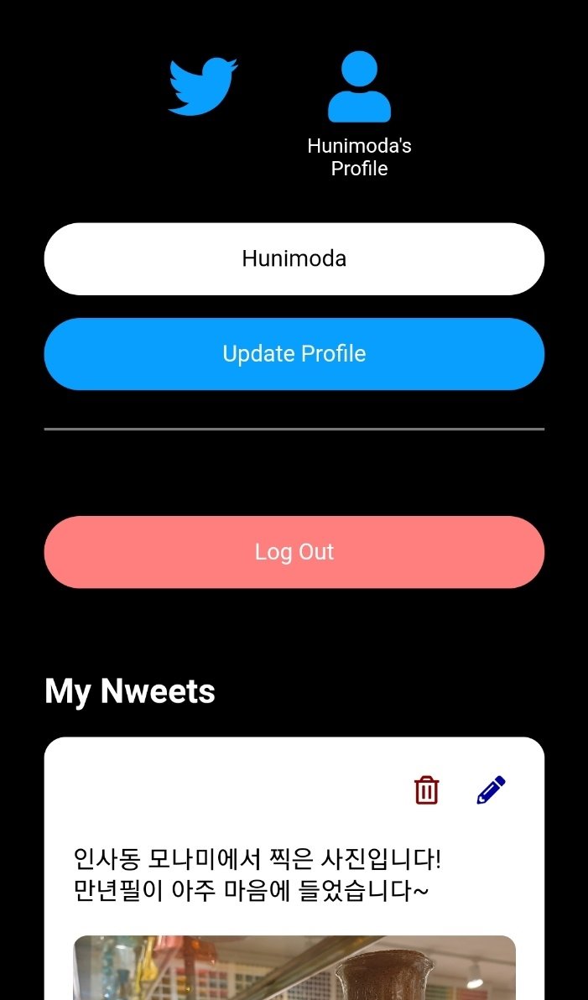

# 트위터 클론

- 설명

노마드코더의 **트위터 클론코딩** 과정을 따라하면서 만든 리포지토리. 리액트 어플리케이션이며 _파이어베이스_ 와 함께 구동된다. 파이어베이스 입문 공부를 위해 제작하였으며 코드의 과반 이상을 노마드코더의 코드를 보면서 따라 작성했다. 글과 사진을 업로드할 수 있는 간단한 CRUD 기능 구현. 모바일 친화적으로 구성하려고 노력했다.  

- 구현 사항

  [1] 로그인

  - 소셜 로그인

    구글 또는 깃허브 계정을 통해 로그인할 수 있다.

  - 일반 메일

    일반 계정을 생성하여 로그인할 수 있다.

  
  
로그인 화면
 

  [2] CRUD

  - Create

    글을 작성하거나 사진을 첨부하여 트윗을 생성할 수 있다.사진을 선택하면 미리보기로 사진을 확인할 수 있으며 삭제하고 다른 사진을 업로드할 수도 있다.

  
  
트윗 생성
 

  - Read / Delete

    작성한 트윗은 실시간으로 확인 가능하다. 최근에 작성한 트윗이 더 상위에 위치한다. 본인이 작성한 트윗은 편집 또는 삭제할 수 있으며 휴지통 아이콘을 클릭하면 트윗은 삭제된다.

  
  
작성한 트윗 확인 및 삭제
 

  - Update

    연필 모양 아이콘을 클릭하면 트윗을 수정할 수 있다. 사진 수정 기능은 구현하지 않았으며, 텍스트는 작성되는 것에 맞추어 높이가 바뀐다. 텍스트가 변경된 경우에만 수정 버튼이 활성화된다. 트윗을 수정하면 화면에 즉시 수정 사항이 반영된다.

  
  
트윗 수정
 

  
  
변경된 모습
 

  [3] 프로필

  - 이름

    이름을 수정할 수 있다. 수정된 이름은 프로필 메뉴에 반영된다.

  - 로그아웃

    빨간색 로그아웃 버튼을 클릭하면 로그아웃 된다.

  - 내가 작성한 트윗

    홈에서는 모든 트윗을 볼 수 있는 반면 프로필 페이지에서는 내가 작성한 트윗만 모아서 볼 수 있다. 작성된 트윗이 하나도 없다면 해당 사실을 화면에 표시한다.

  
  
프로필 화면
 

  
  
프로필 수정
 
